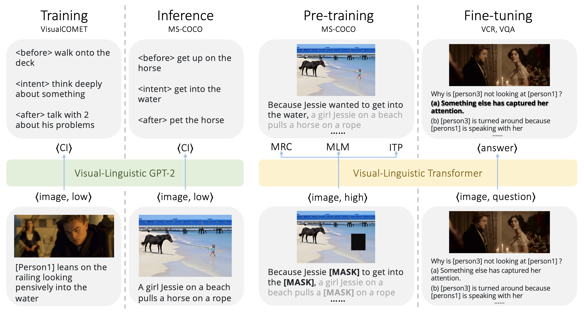
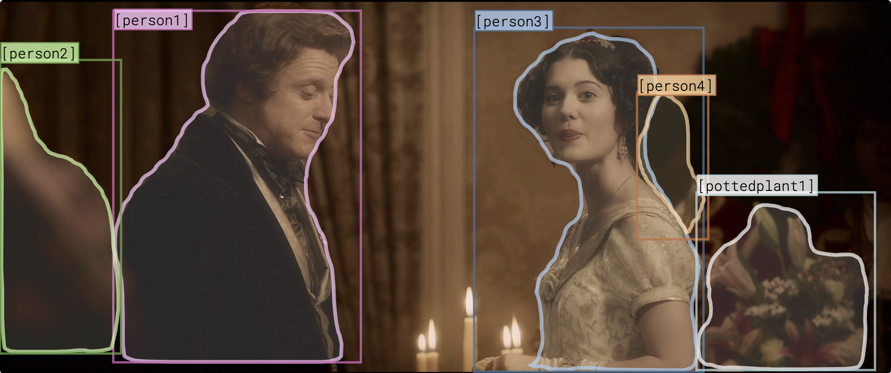
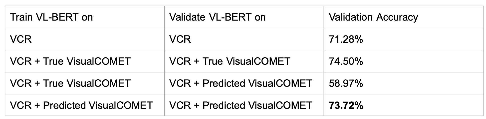

# Machine Commonsense (MCS)
Large-scale visual-linguistic pre-training is essential for downstream vision-language cross-modal tasks, as it can help models capture the generic representation with jointly modeling of the visual and linguistic features. Existing literature mostly focus on learning the semantic connection (i.e. recognition-level understanding) between visual objects and linguistic descriptions, but it is often not sufficient for cognition-level reasoning tasks like VCR. We term the descriptive caption that supports the recognition-level understanding as the low-level caption. In this paper, we propose a novel pre-training framework that also considers models’ ability of inferring commonsense knowledge (e.g. temporal and intentional information). To achieve this, we first train a vision-language GPT-2 as the commonsense inference (CI) generator to generate CIs for COCO Captions. We then introduce the high-level caption, which is the combination of the descriptive caption and CIs, and we argue that it is helpful for learning cognition-level reasoning. We then pre-train a visual-linguistic Transformer that takes in high-level imagecaption pairs by our strategies, including a novel pre-training task of Inference Type Prediction (ITP). Experiments have shown that our pre-trained model performs better in downstream tasks of VCR and VQA compared with the conventional image-caption pre-trained model. We further perform qualitative analysis exploring the reason behind such improvement.


## High-level caption examples

```
'img_fn': 'lsmdc_3005_ABRAHAM_LINCOLN_VAMPIRE_HUNTER/3005_ABRAHAM_LINCOLN_VAMPIRE_HUNTER_00.27.43.141-00.27.45.534@0.jpg',
'img_id': 'val-1569'

============================ VCR ============================
{
  "question": Why is [3] not looking at [1]?
  "answer_choices":
            a) Something else has captured her attention.
            b) [3] is turned around because [1] is speaking with her.
            c) She is too embarrassed to look at him.
            d) [3] does not want [1] to see something that is upsetting her.
  "answer_label": a)
    ...
}

======================== VisualCOMET (ground truth) ========================
{
  "place": "at a fancy party",
  "event": "1 is trying to talk to the pretty woman in front of him",
  "intent": ["ask the woman on a date",
             "get over his shyness"],
  "before": ["approach 3 at an event",
             "introduce himself to 3",
             "be invited to a dinner party",
             "dress in formal attire"],
  "after": ["ask 3 to dance",
            "try to make a date with 3",
            "greet her by kissing her hand",
            "order a drink from the server"]
    ...
}

======================== VisualCOMET (inferred from GPT-2) ========================
{
  "intent": ["show 1 his affection for her",
             "finish speaking with 1"],
  "before": ["have 3 introduce himself to her",
             "walk towards the man"],
  "after": ["talk with 3",
            "talk about what she just saw"]
    ...
}
```

> “Intent”:   PersonX wanted to…</br>
> “Before”: PersonX needed to…</br>
> “After”:    PersonX will most likely...</br>

> The indices in the example above all start from 1. But the raw indices in the VCR annotations start from 0 while the indices in the VisualCOMET annotations and images start from 1.


## Phase 1 (P1)
This phase aims to experiment with adding temporal information from the VisualCOMET dataset to the multiple choice questions in the VCR dataset and see whether the additional sentences can improve the accuracy on the VCR task.


### GPT-2
We use the pre-trained GPT-2 to infer annotations for the training set of the VisualCOMET dataset.

1. Initialize the model
```
pip install .
```

2. Run inference for --split:
```
python scripts/run_generation.py --data_dir ../visualcomet/ --model_name_or_path my_experiment/image-inference-80000-ckpt/ --split train --overwrite_cache
```

### VL-BERT
With the predicted VisualCOMET annotations, we re-train the VL-BERT model so that it accommodates temporal information. I.e., the 'intent', 'before', 'after' information from the VisualCOMET annotations.

1. Train:
```
./scripts/dist_run_single.sh 4 vcr/train_end2end.py cfgs/vcr/base_q2a_4x16G_fp32.yaml ./ckpt
```

2. Eval:
```
python vcr/val.py \
  --a-cfg cfgs/vcr/base_q2a_4x16G_fp32.yaml \
  --a-ckpt ckpt/output/vl-bert-original/vcr/base_q2a_4x16G_fp32/vcr1images_train/vl-bert_base_a_res101-best.model \
  --gpus 1 \
  --result-path eval --result-name original
```

### Results
<!-- When VL-BERT is trained with ground truth VisualCOMET annotations, we get about 3% increase in VCR accuracy: -->
<!-- #### Comparison -->


<!-- ### Training set
 -->

<!-- #### Validation Accuracy
 -->


## Phase 2 (P2)
### GPT-2
Use re-finetuned GPT-2 to generate high-level captions with only images & low-level captions as inputs.

1. Add setup.py and run (need to run this whenever the code is changed)
```
pip install .
```

2. Fine-tune GPT-2 for COMET:
```
python scripts/run_finetuning.py --data_dir /path/to/visualcomet_annotations/  --output_dir experiments/image_inference --max_seq_len 128 --per_gpu_train_batch_size 64 --overwrite_output_dir --num_train_epochs 5 --save_steps 10000 --learning_rate 5e-5
```

3. INFER for --split:
```
python scripts/run_generation.py --data_dir ../visualcomet/ --model_name_or_path my_experiment/image-inference-80000-ckpt/ --split train --overwrite_cache
```

### VL-BERT
Use additional GPT-2 generated high-level captions to pretrain VL-BERT

1. Pretrain
```
./scripts/dist_run_single.sh 4 pretrain/train_end2end.py ./cfgs/pretrain/VC_base_e2e_16x16G_fp16.yaml ./checkpoint
```

2. Finetune
```
./scripts/dist_run_single.sh 4 vcr/train_end2end.py ./cfgs/vcr/VC_base_q2a_4x16G_fp32.yaml ./checkpoint_pretrain
```

### Oscar
Generate low-level captions to prove that the performance gain is not simply from additional amount of information
1. How to use?
```
python oscar/vcr_captioning.py \
    --do_test \
    --vcr_split train \
    --per_gpu_eval_batch_size 64 \
    --num_beams 5 \
    --max_gen_length 20 \
    --eval_model_dir pretrained_models/checkpoint-29-66420 \
    --num_keep_best 5
```

## Phase 3 (P3)
Experiment with pretrain and/or finetune

### self-critical
1. Another model for generating low-level captions: self-critical
```
export CUDA_VISIBLE_DEVICES=0
conda activate cap
python captioning_demo.py --split_num 16 --split_idx 15
```

### Oscar
1. Generate low-level captions
```
python oscar/vcr_captioning.py \
    --do_test \
    --vcr_split train \
    --per_gpu_eval_batch_size 64 \
    --num_beams 5 \
    --max_gen_length 20 \
    --eval_model_dir pretrained_models/checkpoint-29-66420 \
    --num_keep_best 5
```

### GPT-2
1. Run GPT-2 for VCR
```
conda activate gpt2
export CUDA_VISIBLE_DEVICES=0
export PYTHONPATH=.
python scripts/run_vcr_gen.py --max_seq_len 256 --overwrite_cache --data_dir ./vcr_cache --model_name_or_path experiments/event_name/checkpoint-183445/ --cache_postfix vcr --output_file ./vcr --part_num 8 --part_idx 0
```

### VL-BERT
1. Finetune VCR with high level caption for all images
```
./scripts/dist_run_single.sh 1 vcr/train_end2end.py cfgs/vcr/IAN_VCR_base_q2a_4x16G_fp32.yaml ./ckpt_all_vcr
```
