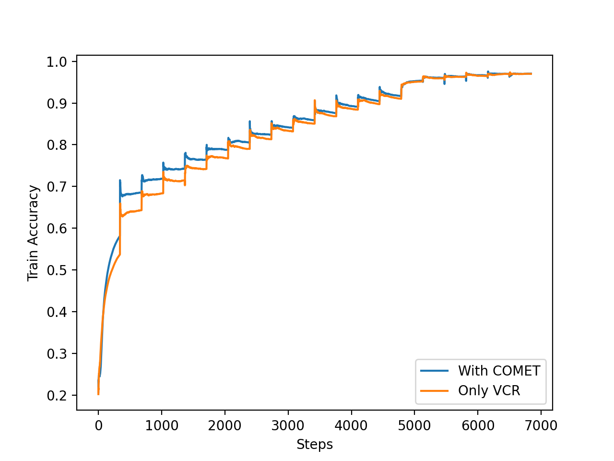
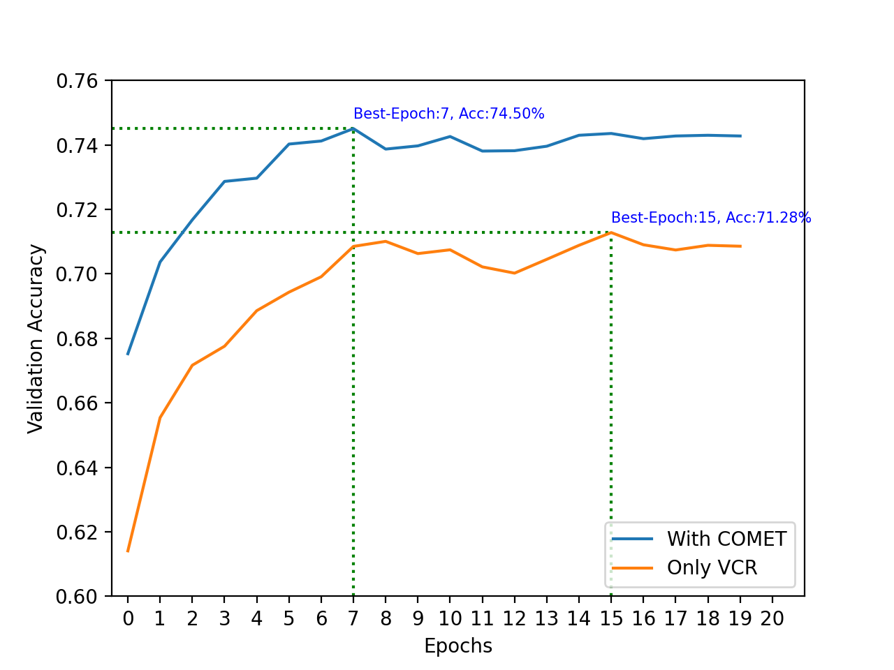

# Machine Commonsense (MCS)
The project aims to experiment with adding temporal information to VCR and see whether the addition sentences can improve the accuracy on the VCR task.

> Work in progress

## GPT-2
We use the pre-trained GPT-2 to infer annotations for the training set of the VisualCOMET dataset.

### Usage
Initialize the model
```
$ pip install .
```

Run inference for --split:
```
$ python scripts/run_generation.py --data_dir ../visualcomet/ --model_name_or_path my_experiment/image-inference-80000-ckpt/ --split train --overwrite_cache
```

## VL-BERT
With the predicted VisualCOMET annotations, we re-train the VL-BERT model so that it accommodates temporal information. I.e., the 'intent', 'before', 'after' information from the VisualCOMET annotations.

### Usage
Train:
```
$ ./scripts/dist_run_single.sh 4 vcr/train_end2end.py cfgs/vcr/base_q2a_4x16G_fp32.yaml ./ckpt
```
Eval:
```
$ python vcr/val.py \
  --a-cfg cfgs/vcr/base_q2a_4x16G_fp32.yaml \
  --a-ckpt ckpt/output/vl-bert-original/vcr/base_q2a_4x16G_fp32/vcr1images_train/vl-bert_base_a_res101-best.model \
  --gpus 1 \
  --result-path eval --result-name original
```

## Current Results
When VL-BERT is trained with ground truth VisualCOMET annotations, we get about 3% increase in VCR accuracy:

### Training set


### Validation set

